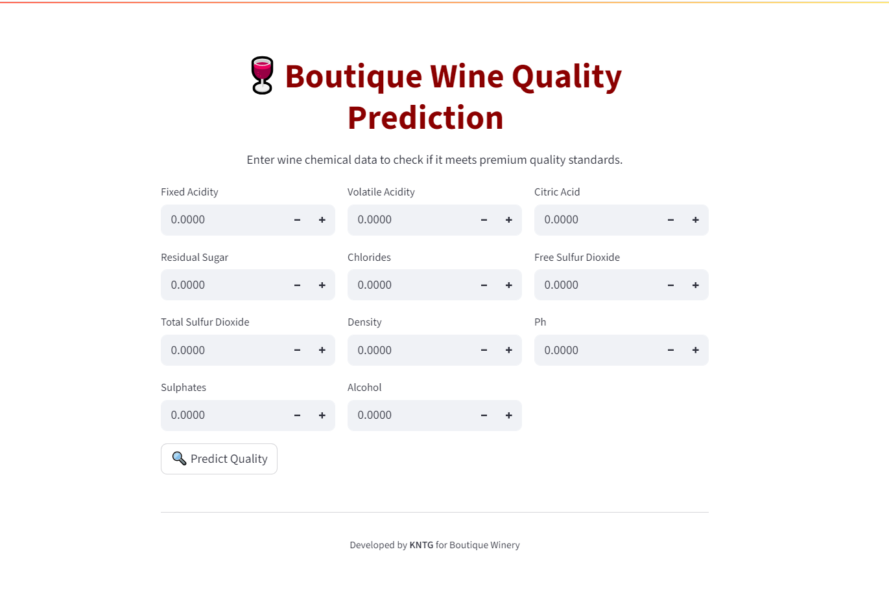

# 🍷 Wine Quality Predictor

A simple and interactive web app built with **Streamlit** that predicts whether a wine sample is of **Good Quality** or **Not Good Quality**, based on its chemical composition.

---

## 📂 Project Structure
📦 wine-quality-predictor/
├── app.py # Main Streamlit app
├── wine_quality_model.pkl # Pre-trained ML model
├── scaler.pkl # Scaler used to preprocess input features
├── requirements.txt # Dependencies


---

## 🧠 Features

- ✅ Predicts wine quality as **Good** or **Not Good**
- 📈 Confidence score shown for predictions
- 🧪 Accepts user input for 11 chemical features:
  - Fixed acidity
  - Volatile acidity
  - Citric acid
  - Residual sugar
  - Chlorides
  - Free sulfur dioxide
  - Total sulfur dioxide
  - Density
  - pH
  - Sulphates
  - Alcohol

---

## ⚙️ Installation

1. Clone this repo:
   ```bash
   git clone https://github.com/your-username/wine-quality-predictor.git
   cd wine-quality-predictor

